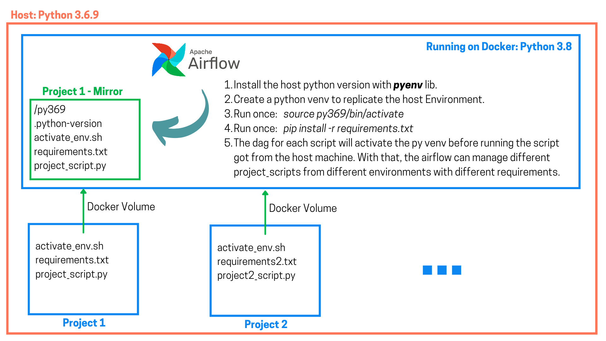

# A different way of using Airflow as a Service, with pyenv.

**Have you ever needed to automate your data flow and scripts coming from different machines and environments ?** The idea arose from a specific problem that was proposed to me where we needed to install airflow and automate all the projects that run on each device with their specific requirements and environments.

One of the ways to allow this to happen is to run Airflow as a Service, so that it runs along with OS activation. But the problem with this idea is that we would need to install Airflow on the host machine of the entire industrial park (in case you work on a big company), and anyone who has tried to do that knows that Airflow without Docker can be extremely problematic.

On the other hand, I propose an Airflow Docker architecture so that we can automate the scripts of different machines, replicating their specific environments and requirements inside the Docker Container through **python virtual environments** and **Docker volumes**.

The idea is that you can use Airflow as a service without actually doing it. That way, Airflow will run on its own inside the container, and each python project that is included in your dags flow will create a replica of the host python environment inside the docker. Thus, that project's dag will be able to activate the virtual python environment before running the project's scripts.

Notice that we only create the py venv once for each project. After that, we only need to activate it when running the respective project_scripts.

**Also, since we are using volumes, if the Docker Container goes down, all project environments will remain intact because they will be saved within the host, not the container.** 

Down below you can checkout its architecture.

To test the PoC above you must follow the following steps:

1. Run: `docker-compose.yaml build && docker-compose up`
2. Run: `bash mnt/airflow/dags/projects/example_project/example_postinst.sh` to create the project's virtual environment inside the docker, activate it and install the `requirements.txt`.
3. That done, you can run your dag. The dag will run `run_example.sh` which is responsible for activanting the py369 and running the script.
4. If you are successful, a `pi.txt` file will appear inside `/mnt/airflow/dags/scripts/project1/`. If not, a "Python Version" error will be printed out. 

Obs: All the paths must be those from inside the container, since it volumes the path from the host into the container.
